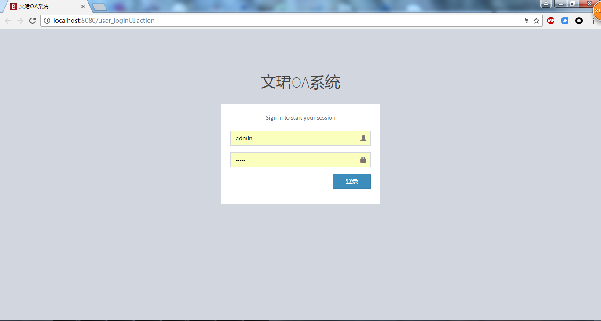
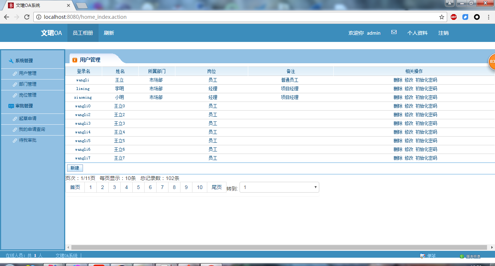
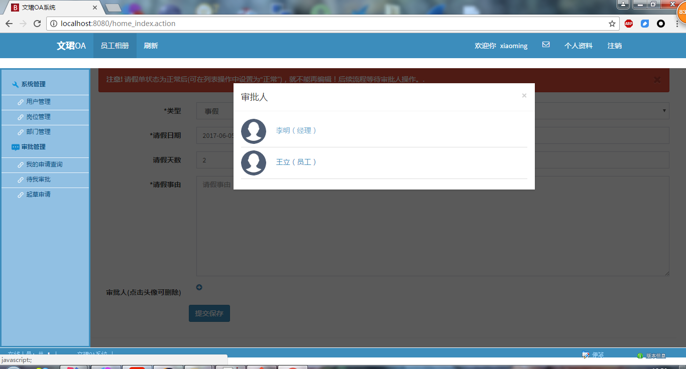
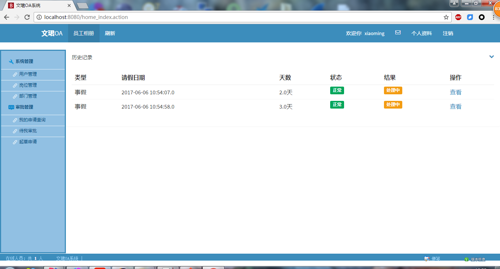
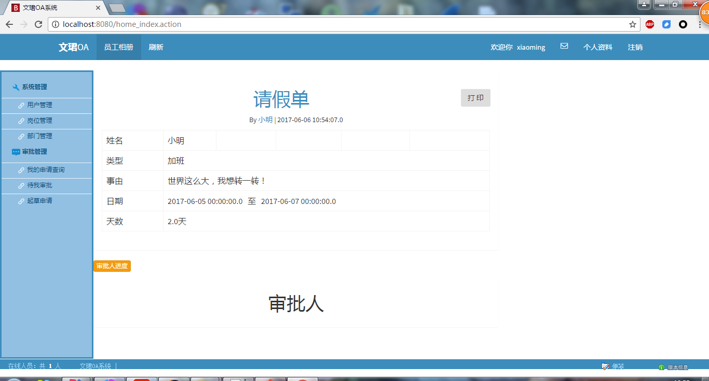
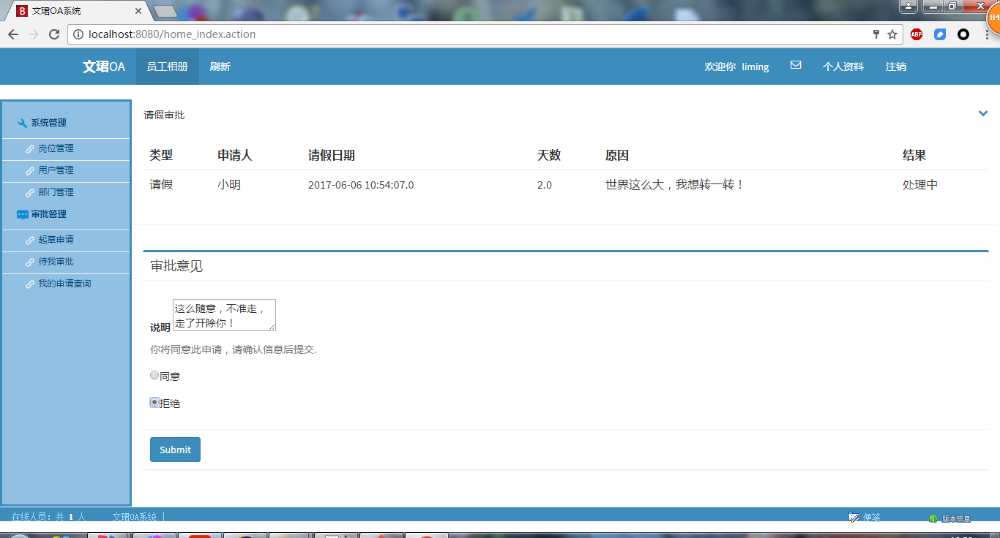
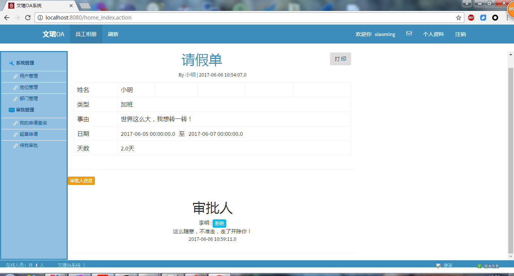

# 文珺OA系统
本系统采用SpringMVC+Hibernate+Spring框架整合开发，数据库使用MySQL，构建工具是Gradle。其中前台页面使用了Bootstrap中的一个模板AdminLTE进行美化，可导入IntelliJ IDEA使用。
参考了多个OA相关的项目，大概实现了以下几个模块：
1.系统管理->用户管理，岗位管理[核心权限分配]，部门管理。
2.审批管理
3.相册管理
4.公告管理

其中工作流部分因为时间关系，流程定死了，没有采用JBPM或是Activiti之类的工作流。项目是业务时间开发，项目代码量小，简单容易理解，可以作为入门项目参考。

部门效果图如下:

